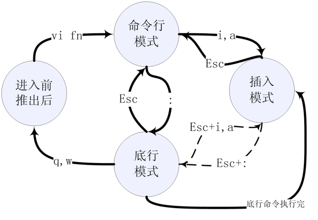
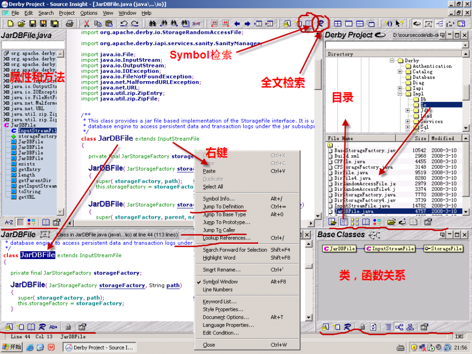

先关掉防火墙及SELinux。

### 开源与免费  主要是一种做事的思路，不仅仅是技术。
开源不一定免费，免费不一定开源。没有在现实社会中PK，很多风险是不知道的，开源一般是有版权的。优先使用开源软件的衍生软件，那个稳定使用哪个。一般情况最好不要使用开源软件，科研一般用开源。充分使用官方资源。  
缺少统一的标准；应用不稳定，兼容性不好，版本变化太快。  
Windows下一个东西在Linux会是N个， 所以：toolschain的概念。开源开发环境所需的各个部件需要逐个安装！  

### Linux Shell：  即时帮助man，info帮助，其次是Google。
历史命令操作：history：列出历史命令。！xxx：执行某个命令。上下箭头：回顾某个命令
查找技术：Find，Grep,egrep,fgrep，locate查找符合条件的文件。
基本命令包括系统维护，目录操作，文件与文本处理，压缩与备份，磁盘操作，系统管理，网络通信。元字符（meta characte）。
高级命令包括网络客户端，更改计算机名字，Linux fdisk，数据处理，Linux Network Management。

了解系统基本信息：如何查看Linux的版本，查看使用哪个shell及版本，Linux环境变量。env，printenv，etc/profile，uname -r。

sudo mv index.php index2.html 

rpm -ivh 安装软件。rpm -qa |grep xxx rpm -e xxx。同样一个软件在不同系统中大小写不一致。vmliunz--内核。
dmesg | more是启动信息。rc rc.d目录。 modrobe,insmod,modinfo,rmmod，Lsmod。

### VIM：命令行模式，编辑模式，底行模式

1）vim fn打开文件，默认进入命令行模式，可接受各种命令，比如使用上下箭头浏览，搜索等。无论何时，按Esc进入命令行模式（normal模式）。
2）按：（也就是Shift+;)进入底行；按i或a进入编辑模式。进入编辑模式后，命令行模式的键全部失效，包括移动上下左右的箭头。
3）插入模式和底行模式之间没有直接转换方式，需要通过命令行模式。

命令行模式：浏览文本
上下箭头：
Ctrl+f：向文件尾翻一屏。
Ctrl+d：向文件尾翻半屏。
Ctrl＋b；向文件首翻一屏。
Ctrl+u：向文件首翻半屏。  

命令行模式：选择拷贝粘贴。必须先按esc进入命令行模式  
选择拷贝：v开始，使用y结束，并拷贝到剪贴板。  
选择剪切：v开始，使用d结束，并拷贝到剪贴板，并删除原文。  
粘贴：p   

dd删除行，yy将当前行放入剪贴板。  

命令行模式：redo，undo。必须先按esc进入命令行模式
r表示redo，u表示undo

命令行模式：搜索
/pattern  从光标开始处向文件尾搜索pattern，注意:没有冒号。
?pattern：从光标开始处向文件首搜索pattern。
n 在同一方向重复上一次搜索命令。N：在反方向上重复上一次搜索命令。

底行模式：
:w    保存当前文件。
:w filename     存入文件 filename 中。
:q 退出。
:q!  不保存并退出，当修改了文件后必须要加！。
:wq 保存并退出。
:x  保存当前文件并退出

底行模式：执行shell命令
：!command：执行shell命令command。r!command：将命令command的输出结果放到当前行 。

底行模式：替换

### SourceInsight3.5 代码变色，大小改变。
可以显示10层依赖关系，但是有时不显示，或滞后显示，

### 应用软件- curl - wget

wget只用于下载，可以递归下载目录。  
curl主要用于通过url交互。可以进行下载，但是不支持递归下载。

### 运行环境：LNMP，LAMP
https://oneinstack.com/docs/lnmp

MySQL的管理器：PhpMyAdmin   
phpmyadmin/config.inc.php  
将config.sample.inc.php改成config.inc.php  
$cfg['Servers'][$i]['AllowNoPassword'] = TRUE;

### 其他问题：

Your CPU does not support long mode, use a 32bit distribution.   
F10进BIOS. 开启VT：Security -> System Security -> enable VT

git子模块是为一个Git仓库中添加其他Git 仓库

